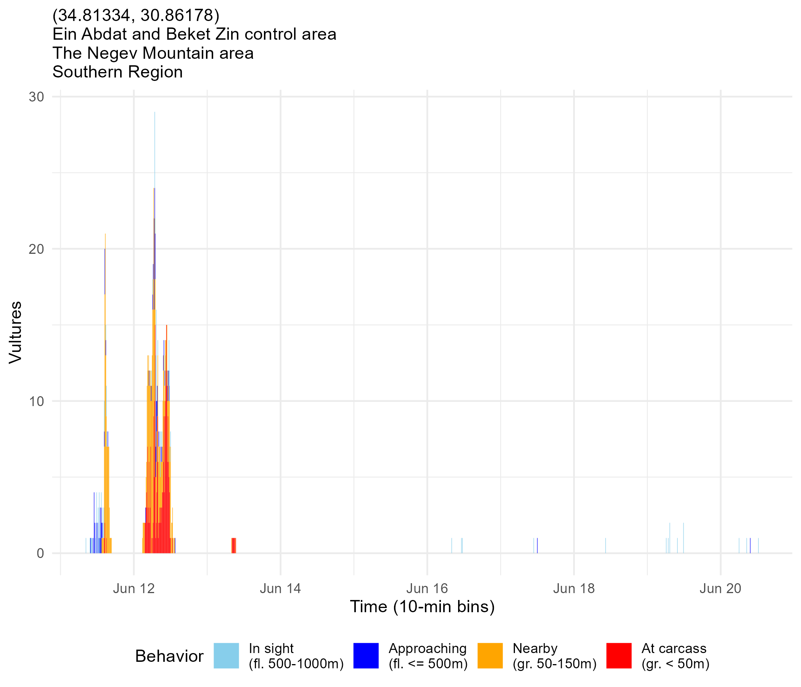
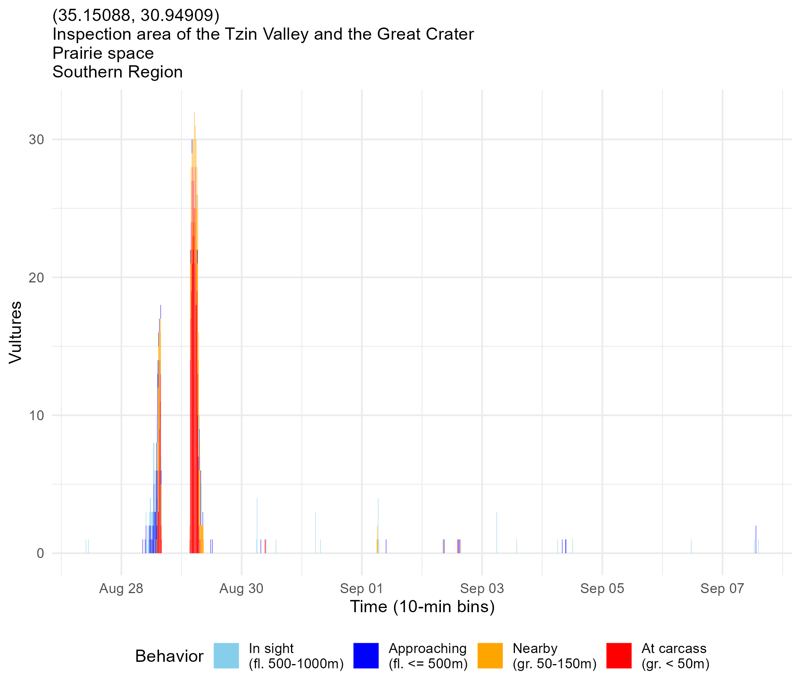
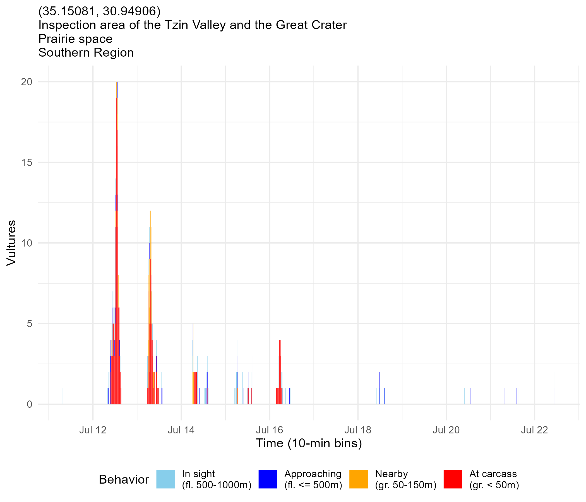

```{r}
# SETUP; load and prep data
library(targets)
library(tidyverse)
library(here)
library(lubridate)
library(ggmap)
library(sf)
library(viridis)
library(mapview)
library(ggspatial)
library(readr)
source(here("R/functions.R"))
library(patchwork)
library(spatsoc)

tar_load(all_carcasses_annotated)
aca <- all_carcasses_annotated
tar_load(all_bouts_annotated)
aba <- all_bouts_annotated
tar_load(carcass_bouts)
tar_load(carcass_bouts_df)
tar_load(stations)
tar_load(bbox_south)
tar_load(carcasses_audited)
```

## How do vultures find carcasses?

. . .

- individual information
  - memory
  - searching
  
. . .

- social information 
  - in-flight (local enhancement)
  - following from the roost (information center hypothesis)
  
. . .

A combination of all of these!

## What factors affect reliance on different information sources?

. . .

H1: Resource predictability affects reliance on social information

. . .

- P1: Where resources are unpredictable, vultures will rely more on social information to find them.

. . .

*Predictability: spatial and temporal*

. . .

Following:

- find new location
- know when to bother flying far --> wild carcasses?

## Feeding station (INPA) carcasses

```{r}
aca <- aca %>%
  mutate(stationName = factor(stationName, levels = sort(unique(aca$stationName))))

stn_carcass_timeline <- st_crop(aca, bbox_south) %>%
  filter(!cage, carcType == "inpa", stationName != "Other") %>%
  dplyr::select(datetime, dateOnly, year, stationName) %>%
  left_join(dg(stations) %>% 
              dplyr::select(stationName, "stnlong" = long, "stnlat" = lat)) %>%
  mutate(stationName = factor(stationName),
         stationName = fct_reorder(stationName, stnlat)) %>%
  ggplot(aes(x = datetime, y = stationName, col = stnlat))+
  scale_color_viridis_c()+
  geom_point(size = 3, alpha = 0.8)+
  facet_wrap(~year, scales = "free_x")+
  theme_bw()+
  theme(legend.position = "none",
        axis.title.y = element_blank(),
        axis.title.x = element_blank(),
        panel.spacing = unit(1, "lines"))+
  scale_x_datetime(date_breaks = "1 week",
                   date_labels = "%d %b")
#stn_carcass_timeline

mp <- st_crop(stations, bbox_south) %>%
  filter(stationName %in% (aca %>%
                             filter(!cage, carcType == "inpa", 
                                    stationName != "Other") %>%
                             pull(stationName))) %>%
  mutate(stationName = factor(stationName),
         stationName = fct_reorder(stationName, lat)) %>%
  ggplot()+
  annotation_map_tile(type = "cartolight", zoom = 10)+ 
  geom_sf(aes(col = lat), size = 3, alpha = 0.8)+
  scale_color_viridis_c()+
  ggrepel::geom_label_repel(
    aes(label = stationName,
        geometry = geometry),
    stat = "sf_coordinates",
    min.segment.length = 0.5,
    size = 3
  )+
  theme(legend.position = "none",
        axis.title.y = element_blank(),
        axis.title.x = element_blank())+
  NULL
```


```{r}
stn_carcass_timeline | mp
```

## Wild carcasses

```{r}
wild_carcass_timeline <- st_crop(aca, bbox_south) %>%
  st_transform("WGS84") %>%
  bind_cols(setNames(as.data.frame(st_coordinates(.)), c("long", "lat"))) %>%
  filter(carcType == "wild") %>%
  ggplot(aes(x = dateOnly, y = lat))+
  geom_point(size = 3, alpha = 0.8, aes(col = lat), pch = 8)+
  scale_color_viridis_c()+
  facet_wrap(~year, scales = "free_x")+
  theme_bw()+
  theme(axis.title.x = element_blank(),
        panel.spacing = unit(1, "lines"),
        legend.position = "none")+
  scale_x_date(date_breaks = "1 week",
               date_labels = "%d %b")+
  labs(y = "Latitude")

mp_wild <- st_crop(aca, bbox_south) %>%
  st_transform("WGS84") %>%
  bind_cols(setNames(as.data.frame(st_coordinates(.)), c("long", "lat"))) %>%
  filter(carcType == "wild") %>%
  ggplot()+
  annotation_map_tile(type = "cartolight", zoom = 10)+ 
  geom_sf(size = 3, alpha = 0.8, aes(col = lat), pch = 8)+
  scale_color_viridis_c()+
  theme(legend.position = "none")+
  NULL
```

```{r}
wild_carcass_timeline | mp_wild
```

## All carcasses

```{r}
st_crop(aca, bbox_south) %>%
  st_transform("WGS84") %>%
  bind_cols(setNames(as.data.frame(st_coordinates(.)), c("long", "lat"))) %>%
  ggplot()+
  annotation_map_tile(type = "cartolight", zoom = 10)+ 
  geom_sf(size = 3, alpha = 0.8, aes(col = lat, shape = carcType))+
  scale_shape_manual(values = c(19, 8), name = "Carcass\ntype")+
  scale_color_viridis_c(guide = "none")+
  #theme(legend.position = "none")+
  facet_wrap(~year)+
  NULL
```

## Other important factors
- location relative to central roosts
- time of day placed

```{r}
carcasses_audited %>%
  filter(!cage, carcassWeight < 1500, lubridate::year(date) > 2018) %>%
  st_as_sf(crs = 32636) %>%
  st_crop(bbox_south) %>%
  filter(stationName != "Other", !is.na(stationName)) %>%
  group_by(stationName) %>%
  filter(n() > 5) %>%
  ggplot(aes(x = carcassWeight))+
  geom_histogram(aes(y = after_stat(density), fill = stationName))+
  facet_wrap(~lubridate::year(date))+
  theme_classic()+
  labs(y = "Density", x = "Carcass weight (kg)")+
  theme(legend.position = "none",
        text = element_text(size = 16))
```

## How?
NBDA--time-ordered information networks. 
  - Model spread; compare to actual spread
  
Find instances of following behavior

## Carcass numbers
```{r}
aca %>%
  group_by(year, carcType) %>%
  summarize(n = n()) %>%
  ggplot(aes(x = factor(year), y = n, fill = carcType))+
  geom_col(position = position_dodge())+
  theme_bw()+
  scale_fill_manual(name = "Carcass\ntype", values = c("blue", "red"))+
  labs(y = "Number of carcasses",
       x = "Year")
```

## INPA carcass visits
```{r}
carcass_stats <- aca %>%
  filter(carcType == "inpa") %>%
  dplyr::select(carcID, X, Y, stationName, carcassWeight, "carcDatetime" = datetime, "carcDate" = dateOnly) %>%
  left_join(carcass_bouts_df, by = "carcID") %>%
  filter(!is.na(year)) %>%
  group_by(carcID, carcDate, carcDatetime, year) %>%
  summarize(nbouts = length(unique(boutID)),
            nindivs = length(unique(individualID)))

carcass_stats %>%
  ggplot(aes(x = nindivs, y = nbouts, col = factor(year)))+
  geom_point(size = 3, pch = 19)+
  geom_smooth(method = "lm")+
  theme_bw()+
  labs(y = "# recorded feeding bouts",
       x = "# individual vultures",
       caption = "(Within 72 hours and 750m of carcass placement at feeding station)")+
  scale_color_manual(name = "Year", values = c("skyblue", "skyblue4"))+
  theme(text = element_text(size = 16))
```

## INPA carcass visits

```{r}
carcass_stats %>%
  pivot_longer(cols = c("nindivs", "nbouts")) %>%
  mutate(name = case_when(name == "nbouts" ~ "Feeding bouts",
                          name == "nindivs" ~ "Individual vultures")) %>%
  ggplot(aes(x = factor(year), y = value, fill = factor(year)))+
  geom_boxplot()+
  scale_fill_manual(values = c("skyblue", "skyblue4"))+
  theme_bw()+
  facet_wrap(~name, scales = "free_y")+
  labs(x = "Year")+
  theme(axis.title.y = element_blank(),
        legend.position = "none",
        text = element_text(size = 16))
```

## Feeding bouts over time: example INPA carcasses

```{r}
tar_load(carcasses_audited)
ca <- carcasses_audited %>% 
  st_as_sf(crs = 32636) %>%
  filter(!cage) %>%
  st_crop(bbox_south) %>%
  dplyr::select(carcID, X, Y, cage, stationName)

ca2 <- ca %>% left_join(carcass_bouts_df, by = "carcID") %>%
  filter(!is.na(time_since_carcass)) %>%
  mutate(hour = round(as.numeric(time_since_carcass))) %>%
  group_by(carcID, stationName, hour) %>%
  summarize(n = n())

max <- hours(72)
all_hours <- expand.grid("carcID" = unique(ca2$carcID), "hour" = -1:72) %>%
  mutate(n = 0) %>%
  left_join(carcasses_audited %>%
              dplyr::select(carcID, stationName) %>%
              distinct())

ca3 <- bind_rows(ca2, all_hours) %>%
  arrange(carcID, hour, desc(n)) %>%
  group_by(carcID, hour) %>%
  slice(1) %>%
  ungroup()

set.seed(6)
ca3 %>% filter(carcID %in% sample(unique(ca3$carcID), 12)) %>%
  mutate(carcID = factor(carcID)) %>%
  ggplot(aes(x = hour, y = n, group = carcID, col = stationName))+
  #geom_point()+
  geom_line(linewidth = 1)+
  theme_classic()+
  facet_wrap(~carcID)+
  labs(y = "Number of feeding bouts",
       x = "Hour since carcass placed")
```

## Feeding bouts over time: all INPA carcasses
```{r}
ca3 %>% 
  mutate(carcID = factor(carcID)) %>%
  ggplot(aes(x = hour, y = n, group = carcID, col = stationName))+
  #geom_point()+
  geom_line(alpha = 0.7)+
  theme_classic()+
  facet_wrap(~stationName)+
  labs(y = "Number of feeding bouts",
       x = "Hour since carcass placed")+
  theme(legend.position = "none")
```

## Animation: 10 days of vultures


## Animation: one carcass


## What determines individual arrival order at a carcass?
- Age: risk-taking
  - H1: Younger → risk-averse b/c weaker, less experienced
  - H2: Younger → risk-prone b/c lower in hierarchy, must take advantage of opportunities

- Arrival order (not same as feeding order!)

- Intraspecific producer-scrounger dynamics: do some individuals consistently eat first?

- Individual information source

## Individuals detecting/arriving over time (example 1)


## Individuals detecting/arriving over time (example 2)


## Individuals detecting/arriving over time (example 3)


## Arrivals versus bouts
Can we use feeding bouts as a way to determine how long a placed carcass persists, somewhat independent of the vulture arrivals? The previous plots show us that vultures keep arriving at a carcass sometimes for a while, but are they actually feeding?
We need:
- info about the vultures arriving at the carcasses (only At carcass or Nearby)
- info about the feeding bouts for each carcass

Plot them on the same axes to compare.

```{r}
source(here("R/functions.R"))
# jankily re-doing part of the targets pipeline because I want 7 days (168 hours) instead of 72 hours
tar_load(feeding_bouts)
tar_load(carcasses_focal)
tar_load(dist_bouts_carcasses)
tar_load(hours_before_carcass)
hours_after_carcass <- 168
carcass_bouts <- get_carcass_bouts(bouts = feeding_bouts,
                                              carcasses = carcasses_focal,
                                              dist = dist_bouts_carcasses,
                                              hours_before = hours_before_carcass,
                                              hours_after = hours_after_carcass)
carcass_bouts_df <- purrr::list_rbind(carcass_bouts)
approach_data <- readRDS(here("data/created/carcass_approach_data.RDS")) # from hf-acc_carcass_arrivals.R. This also uses 7 days (see params.R)
head(approach_data)
head(carcass_bouts_df)
```

Simplify
```{r}
arrivals <- approach_data %>%
  filter(category %in% c("ground_at", "ground_near")) %>%
  select("id" = tag_local_identifier, timestamp, dateOnly, dist_to_carcass, time_since_carcass, carcID, category) %>%
  mutate(dateOnly = lubridate::date(dateOnly),
         type = "arrival")
bouts <- carcass_bouts_df %>%
  select("id" = individualID, start, end, dateOnly, dist_to_carcass, time_since_carcass, carcID) %>%
  mutate(type = "bout")

both <- bind_rows(arrivals, bouts) %>%
  mutate(time_since_carcass = hms::hms(seconds_to_period(time_since_carcass)))
```

Restrict to carcasses that have at least one row of each
```{r}
both <- both %>%
  group_by(carcID) %>%
  filter(length(unique(type)) == 2)

length(unique(both$carcID)) # this gives us 30 carcasses that have at least one feeding bout and at least one arrival
```

Visualize
```{r}
set.seed(3)
both %>%
  filter(carcID %in% sample(unique(both$carcID), 3)) %>%
  ggplot(aes(x = time_since_carcass, y = dist_to_carcass))+
  geom_point(aes(col = type), alpha = 0.5, size = 3, pch = 1)+
  facet_wrap(~carcID, ncol = 1)+
  theme_classic() # looks like feeding bouts can extend as far out as 7 days
```

Need to do some more exploration here to figure out the carcass duration--e.g. does the ratio of number of bouts to number of proximity points change over time? What about the number of unique individuals feeding?

```{r}
props <- both %>%
  group_by(carcID, dateOnly, type) %>%
  summarize(n = n(),
            nindivs = length(unique(id))) %>%
  pivot_wider(id_cols =c("carcID", "dateOnly"),
              names_from = "type",
              values_from = c("n", "nindivs")) %>%
  mutate(bout_arrival_ratio_n = n_bout/n_arrival,
         bout_arrival_ratio_nindivs = nindivs_arrival/nindivs_bout) %>%
  ungroup() %>%
  arrange(carcID, dateOnly) %>%
  group_by(carcID) %>%
  mutate(day = 1:n())

props %>%
  ggplot(aes(x = day, y = bout_arrival_ratio_nindivs, group = carcID, col = factor(carcID)))+
  geom_point()+
  geom_line()+
  theme_classic()
```
This doesn't really help... there are at least some feeding bouts even 7 days after the carcass was placed.
```{r}
props %>%
  ggplot(aes(x = day))+
  geom_point(aes(y = n_arrival), col = "red")+
  geom_line(aes(y = n_arrival), col = "red")+
  geom_point(aes(y = n_bout), col = "blue")+
  geom_line(aes(y = n_bout), col = "blue")+
  facet_wrap(~carcID)+
  theme_minimal() # there are some carcasses for which the arrivals persist longer than the bouts, but not many
```

